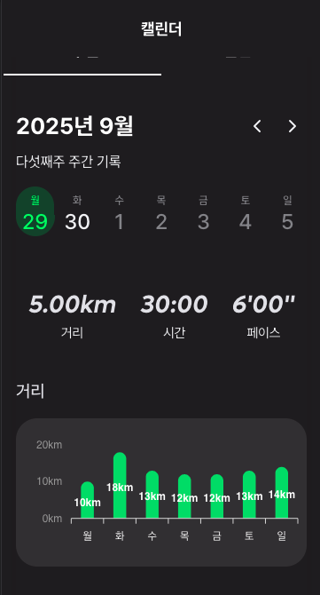

# 실시간 그룹 러닝 웹 서비스 (Frontend)

실시간 러닝 데이터를 기반으로 
러닝 경로·통계·보상 요소를 시각적으로 제공하는 **WebView 기반 러닝 서비스의 프론트엔드**입니다.

모바일 앱(WebView) 환경을 고려하여  
실시간 데이터 동기화와 UI 성능 최적화에 중점을 두었습니다.

---

## Tech Stack

- Next.js (App Router)
- TypeScript
- TanStack Query
- Jotai
- Tailwind CSS
- Recharts
- Google Maps API

---

## Key Features

- 단일 러닝 세션 기준 GPS 경로 시각화 UI 구현 (Polyline 기반)
- 러닝 거리·시간·페이스 통계 대시보드 (스와이프 화면 전환)
- 가챠 기반 보상 UI 및 애니메이션
- 러닝 기록 캘린더 (Framer Motion 드래그 인터랙션)
- 모바일 앱(WebView) 환경 대응 UI

---

## 📸 Screenshots (WebView UI)

### 러닝 경로 시각화 화면
> 단일 러닝 세션 기준 GPS 경로를 지도 위에 시각화한 화면


---

### 러닝 통계 대시보드
> 거리, 시간, 페이스 정보를 카드 및 차트 형태로 표현


---

### 러닝 기록 캘린더
> 월간/주간 뷰 전환이 가능한 기록 조회 캘린더



---

### 가챠 보상 UI
> 러닝 완료 후 보상을 획득하는 인터랙션 UI


---

## Technical Challenges & Solutions

### 1. 앱-웹 간 통신 최적화

**문제**: React Native 앱과 WebView 간 원활한 데이터 통신 필요


**해결 방안**:

- `postMessageToApp` 유틸리티 함수를 통한 양방향 통신 구조 확립

- Module 기반 메시지 타입 정의로 타입 안정성 확보

- localStorage를 활용한 앱-웹 간 상태 공유 (닉네임, 클로버 개수 등)


```typescript

// utils/apis/postMessageToApp.ts

const postMessageToApp = (module: MODULE, data: string) => {

window.ReactNativeWebView?.postMessage(

JSON.stringify({ module, data })

);

};

```


**성과**:

- 앱과 웹 간 끊김 없는 사용자 경험 제공

- 네비게이션 및 데이터 동기화 안정성 확보


### 2. 상태 관리 전략

**문제**: 서버 상태, 클라이언트 전역 상태, 로컬 상태가 혼재되어 복잡도 증가


**해결 방안**:

- **서버 상태**: TanStack Query로 일괄 관리 (캐싱, refetching, 낙관적 업데이트)

- **클라이언트 전역 상태**: Jotai의 Atomic 패턴으로 필요한 상태만 구독

- **로컬 상태**: 컴포넌트 내 useState로 관리

- Custom Hooks 패턴으로 비즈니스 로직 분리 (`useUserInfo`, `useWeeklyGoal`, `useGacha` 등)


**성과**:

- 명확한 상태 관리 계층 구조 확립

- 불필요한 리렌더링 최소화로 성능 개선

- 코드 가독성 및 유지보수성 향상